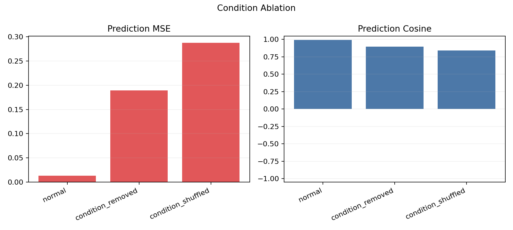

# Original LeWM vs Residual LeWM 15 Epoch 测评报告

## 1. 实验对象

| 项目 | Original LeWM | Residual LeWM |
|---|---:|---:|
| Checkpoint | `lewm_15/weights_epoch_15.pt` | `lewm_residual_15/weights_epoch_15.pt` |
| Latent 样本数 | 1024 | 1024 |
| z_context shape | `[1024, 3, 192]` | `[1024, 3, 192]` |
| z_target shape | `[1024, 3, 192]` | `[1024, 3, 192]` |
| z_pred shape | `[1024, 3, 192]` | `[1024, 3, 192]` |
| detected horizons | 3 | 3 |
| latent dim | 192 | 192 |
| action ablation | 已导出 zero / shuffled action | 已导出 zero / shuffled action |

---

## 2. 核心指标总表

| 指标 | Original LeWM | Residual LeWM | 结果倾向 |
|---|---:|---:|---|
| Success rate | 88.0% | **92.0%** | Residual 更高 |
| Open-loop MSE mean | **0.01070** | 0.01311 | Original 更低 |
| Mean cosine(z_pred, z_target) | **0.99399** | 0.99254 | Original 略高 |
| Diagonal gap | **0.20243** | 0.16525 | Original 时间对齐更清晰 |
| Top-1 horizon matching accuracy | **98.70%** | 96.65% | Original 更高 |
| Active dims z_pred | 192 / 192 | 192 / 192 | 二者均无明显坍塌 |
| Effective rank z_pred | **59.59** | 58.32 | Original 略高 |
| Zero-action MSE gap | **+0.23029** | +0.17629 | Original 更依赖正常 action |
| Shuffled-action MSE gap | **+0.36815** | +0.27431 | Original 更依赖正常 action |
| Zero-action cosine drop | **-0.12326** | -0.09658 | Original drop 更大 |
| Shuffled-action cosine drop | **-0.19520** | -0.14899 | Original drop 更大 |

说明：Residual 的最终 success rate 更高，但 Original 在 open-loop prediction、horizon alignment 和 action ablation gap 上更强。也就是说，Residual 的任务成功率提升没有表现为更低的 latent prediction MSE。

---

## 3. Success Rate / Planning 指标

| 指标 | Original LeWM | Residual LeWM |
|---|---:|---:|
| Success rate | 88.0% | **92.0%** |
| eval episodes | 50 | 50 |
| 成功数 | 44 / 50 | **46 / 50** |
| CEM solve time 记录条数 | 4 | 12 |
| 日志中 CEM solve time 总和 | 143.45s | 112.48s |
| 日志中 CEM solve time 均值 | 35.86s | 9.37s |
| 日志文件 | `logs/pusht_lewm15_eval_seed0.log` | `logs/pusht_residual15_eval_seed0.log` |

说明：`CEM solve time` 只来自日志中实际打印的行，两个模型记录条数不同，不能作为严格 planning time。正式 planning time 应使用 `eval.py` 输出的完整 `evaluation_time / eval.num_eval`。当前可可靠比较的是 success rate：Residual 高 4 个百分点。

---

## 4. Open-loop Prediction 指标

| 指标 | Original LeWM | Residual LeWM | 结果倾向 |
|---|---:|---:|---|
| Open-loop MSE mean | **0.01070** | 0.01311 | Original 更低 |
| Horizon-1 MSE | **0.01091** | 0.01348 | Original 更低 |
| Horizon-2 MSE | **0.01052** | 0.01230 | Original 更低 |
| Horizon-3 MSE | **0.01067** | 0.01356 | Original 更低 |
| Horizon-1 cosine | **0.99392** | 0.99245 | Original 更高 |
| Horizon-2 cosine | **0.99410** | 0.99299 | Original 更高 |
| Horizon-3 cosine | **0.99395** | 0.99218 | Original 更高 |
| Median cosine | **0.99715** | 0.99600 | Original 更高 |
| q95 cosine | 0.99930 | **0.99937** | 接近 |
| z_pred 与 z_target exact equal | false | false | 无直接泄漏证据 |
| z_pred 与 z_target allclose | false | false | 无直接泄漏证据 |

说明：修正 horizon label 后，三个 horizon 都能正确显示。Original 在每个 horizon 的 MSE / cosine 都优于 Residual。Residual 的 success rate 更高，因此不能只用 open-loop MSE 解释最终任务表现。

---

## 5. Prediction Alignment 可视化

### 5.1 Target-Pred Alignment Heatmap

| Original LeWM | Residual LeWM |
|---|---|
|  |  |

| 指标 | Original LeWM | Residual LeWM | 含义 |
|---|---:|---:|---|
| diagonal mean | **0.99399** | 0.99254 | 正确 horizon 的 pred-target cosine |
| off-diagonal mean | **0.79156** | 0.82729 | 错位 horizon 的相似度，越低越好 |
| diagonal gap | **0.20243** | 0.16525 | diagonal 与 off-diagonal 的差距，越大表示时间对齐越清晰 |
| top-1 horizon matching accuracy | **98.70%** | 96.65% | 预测 horizon 最匹配正确 target horizon 的比例 |

说明：二者都有明显对角线，说明都学到了 horizon 对齐。Original 的 off-diagonal 更低、diagonal gap 更大，时间区分更清晰。Residual 的 off-diagonal 更高，说明不同 horizon 的表示更相近，可能更偏向平滑预测。

### 5.2 Target-Pred Cosine vs Horizon

| Original LeWM | Residual LeWM |
|---|---|
|  |  |

| Horizon | Original mean cosine | Residual mean cosine |
|---:|---:|---:|
| 1 | **0.99392** | 0.99245 |
| 2 | **0.99410** | 0.99299 |
| 3 | **0.99395** | 0.99218 |

说明：horizon 轴已修正，现在 CSV 中显示 `1, 2, 3`。Original 在三个 horizon 上均略高。

---

## 6. Action-conditioned / Ablation 分析

### 6.1 Normal vs Zero / Shuffled Action

| Original LeWM | Residual LeWM |
|---|---|
|  |  |

| 模型 | Condition | MSE | Cosine |
|---|---|---:|---:|
| Original | normal | **0.01070** | **0.99399** |
| Original | zero action | 0.24099 | 0.87073 |
| Original | shuffled action | 0.37885 | 0.79879 |
| Residual | normal | 0.01311 | 0.99254 |
| Residual | zero action | **0.18940** | **0.89596** |
| Residual | shuffled action | **0.28743** | **0.84355** |

| Gap 指标 | Original LeWM | Residual LeWM | 解释 |
|---|---:|---:|---|
| zero-action MSE gap | **+0.23029** | +0.17629 | 去掉动作后 MSE 上升幅度 |
| shuffled-action MSE gap | **+0.36815** | +0.27431 | 打乱动作后 MSE 上升幅度 |
| zero-action cosine drop | **-0.12326** | -0.09658 | 去掉动作后 cosine 下降幅度 |
| shuffled-action cosine drop | **-0.19520** | -0.14899 | 打乱动作后 cosine 下降幅度 |

说明：两个模型都明显使用了 action，因为 zero/shuffled action 会显著恶化预测。Original 的 gap 更大，说明它对正确 action 更敏感；Residual 即使动作被 zero/shuffled，退化幅度较小，可能更依赖当前 latent 的 identity / smoothness。

### 6.2 Action Norm vs Prediction

| Original LeWM | Residual LeWM |
|---|---|
|  |  |
|  |  |
|  |  |

说明：这组图用于观察动作幅度是否影响预测误差。结合 ablation，两个模型都不是完全忽略 action。

### 6.3 Delta-z PCA by Action Norm

| Original LeWM | Residual LeWM |
|---|---|
|  |  |

说明：该图观察 `z_pred - z_context` 是否随 action norm 呈现结构变化。Residual 理论上更强调 delta_z，因此这张图对 Residual 尤其重要。

---

## 7. Latent Collapse / Diversity 可视化

### 7.1 Active Dimension Count

| Original LeWM | Residual LeWM |
|---|---|
|  |  |

| 指标 | Original z_pred | Residual z_pred |
|---|---:|---:|
| active dims | 192 / 192 | 192 / 192 |
| effective rank | **59.59** | 58.32 |
| participation ratio | **54.41** | 52.93 |
| top10 explained variance ratio | **0.2570** | 0.2657 |
| top50 explained variance ratio | **0.9115** | 0.9214 |

说明：两个模型都没有 active dimension collapse。Residual 的 effective rank 略低、top-k explained variance 略高，表示能量略更集中，但差距不大。

### 7.2 Pairwise Cosine Histogram

| Original LeWM | Residual LeWM |
|---|---|
|  |  |

| 指标 | Original z_pred | Residual z_pred |
|---|---:|---:|
| pairwise cosine mean | 0.00050 | 0.00062 |
| pairwise cosine median | -0.02300 | -0.01585 |
| pairwise cosine std | 0.13177 | 0.13362 |
| pairwise cosine q95 | 0.23568 | **0.23022** |

说明：两个模型的 pairwise cosine 都集中在 0 附近，没有大面积接近 1，说明 batch 内 latent 仍有区分度。Residual 与 Original 在 diversity 上差异较小。

### 7.3 Covariance Spectrum / Explained Variance

| Original LeWM | Residual LeWM |
|---|---|
|  |  |
|  |  |

说明：Residual 的 top10/top50 explained variance 略高，effective rank 略低，说明 Residual 表示略更集中。当前差距不足以说明坍塌。

---

## 8. Target-Pred Latent Alignment

| Original LeWM | Residual LeWM |
|---|---|
|  |  |
|  |  |

说明：全局 target-pred PCA alignment 直观看预测点和目标点在同一个 PCA 空间中的偏差。结合 MSE 表格看，Original 的点对整体更接近；Residual 虽然 open-loop 更差，但在环境成功率上更高。

---

## 9. 主要结论

| 结论项 | 判断 |
|---|---|
| Success rate | Residual 15 epoch 为 92%，Original 15 epoch 为 88%，Residual 更好 |
| Open-loop MSE | Original 更低，说明原版 latent prediction 更贴近 target |
| Prediction cosine | Original 在三个 horizon 上均略高 |
| Horizon alignment | Original 的 diagonal gap 和 top-1 matching 更高，时间对齐更清楚 |
| Action usage | 两者都使用 action；Original 的 shuffled/zero action gap 更大 |
| Latent collapse | 二者均无明显 collapse，active dims 均为 192/192 |
| Latent diversity | 二者 pairwise cosine 都健康，差距较小 |

综合判断：**Residual LeWM 在最终任务成功率上优于 Original LeWM，但在 open-loop latent prediction、horizon alignment 和 action sensitivity 上不如 Original。** 这说明 Residual 的收益可能来自更平滑、对 planner 更友好的 latent rollout，而不是更精确的 one-step / short-horizon latent prediction。

需要谨慎的是：当前 success rate 只有一个 seed，92% vs 88% 的差距对应 2 个 episode。这个提升有价值，但还不能证明稳定显著。

---

## 10. 后续建议

1. 补跑至少 3 个 seed 的 success eval，报告 mean / std。
2. 正式 planning time 使用 `evaluation_time / eval.num_eval`，不要用不完整 CEM 日志行替代。
3. 进一步分析 residual 是否过度 identity：重点看 delta_norm、target_delta_norm、delta_cos。
4. 保留 action ablation：后续模型都应报告 normal / zero action / shuffled action。
5. 如果 residual 多 seed 仍提升 success rate，可以继续推进 Factored Latent。
6. 如果 residual 多 seed 不稳定，应优先检查 action sensitivity 下降是否影响泛化。
