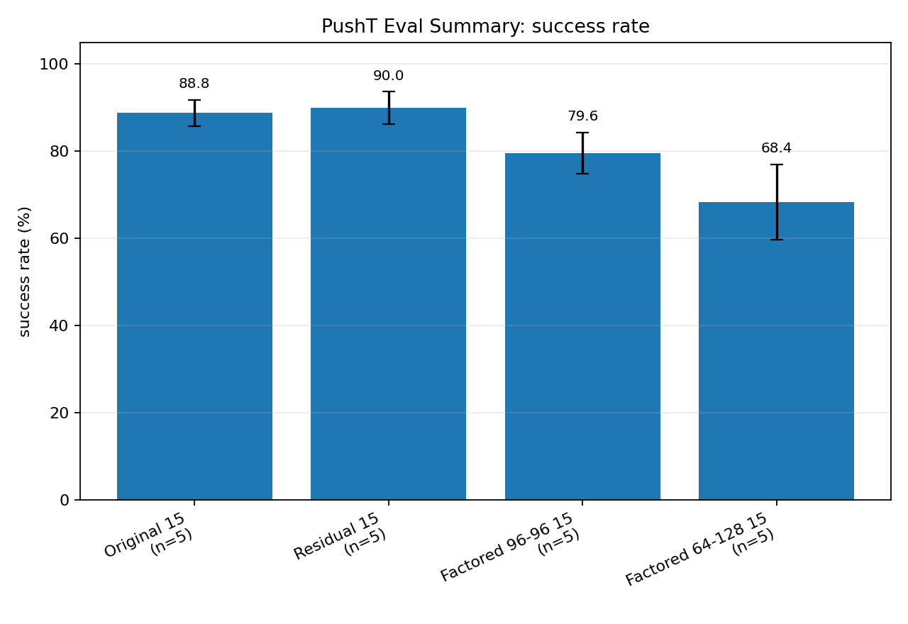
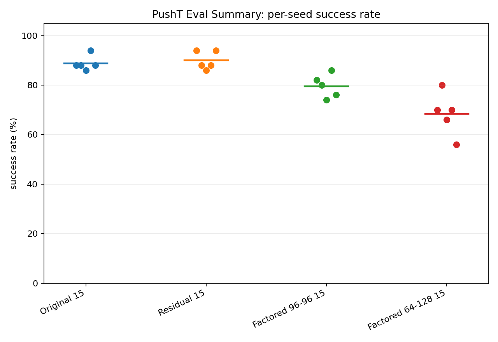
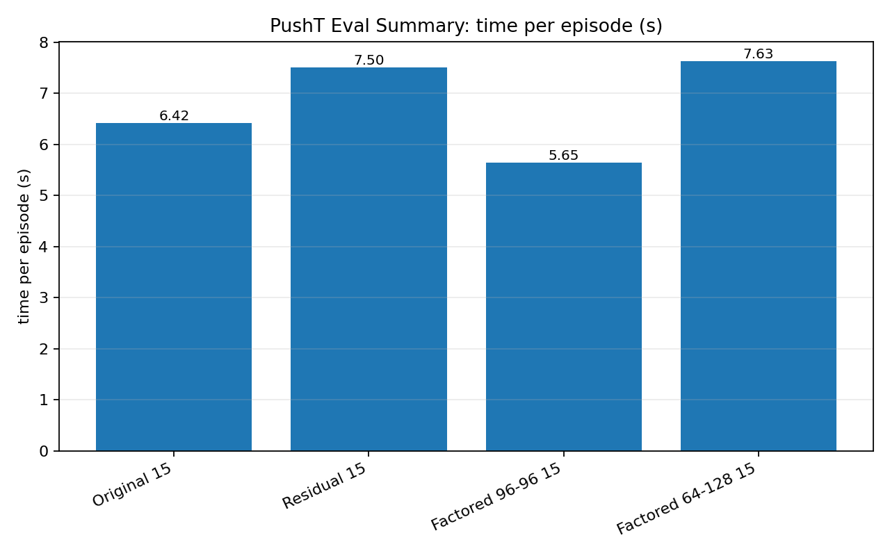

# PushT Eval Summary

## Summary

| group | n | success mean ± std | min | max | time/episode | eval budget | num eval |
|---|---:|---:|---:|---:|---:|---|---|
| Original 15 | 5 | 88.80 ± 3.03 | 86.00 | 94.00 | 6.42s | 300 | 50 |
| Residual 15 | 5 | 90.00 ± 3.74 | 86.00 | 94.00 | 7.50s | 300 | 50 |
| Factored 96-96 15 | 5 | 79.60 ± 4.77 | 74.00 | 86.00 | 5.65s | 300 | 50 |
| Factored 64-128 15 | 5 | 68.40 ± 8.65 | 56.00 | 80.00 | 7.63s | 300 | 50 |

## Figures

