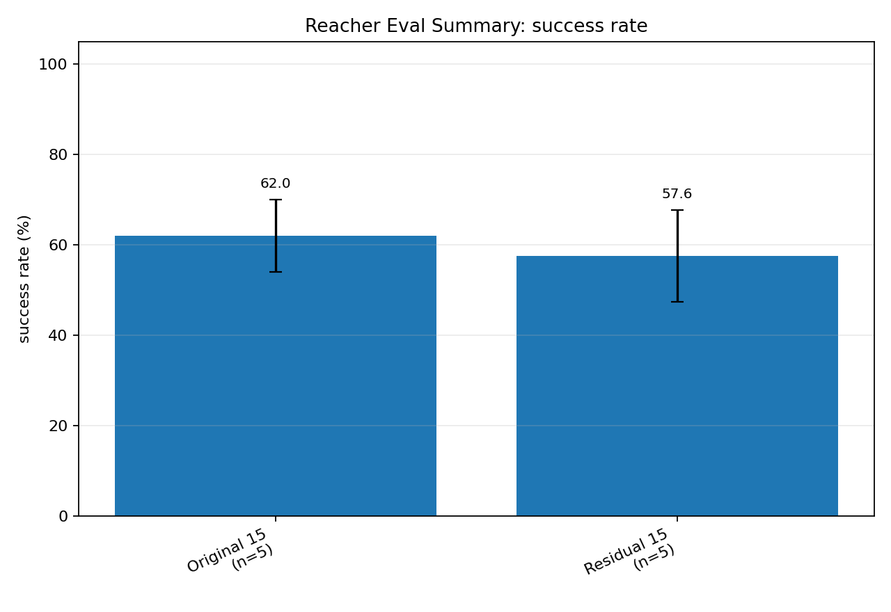
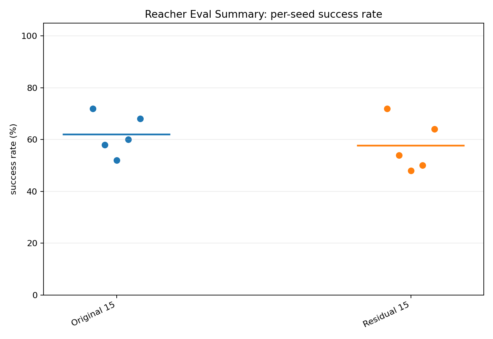
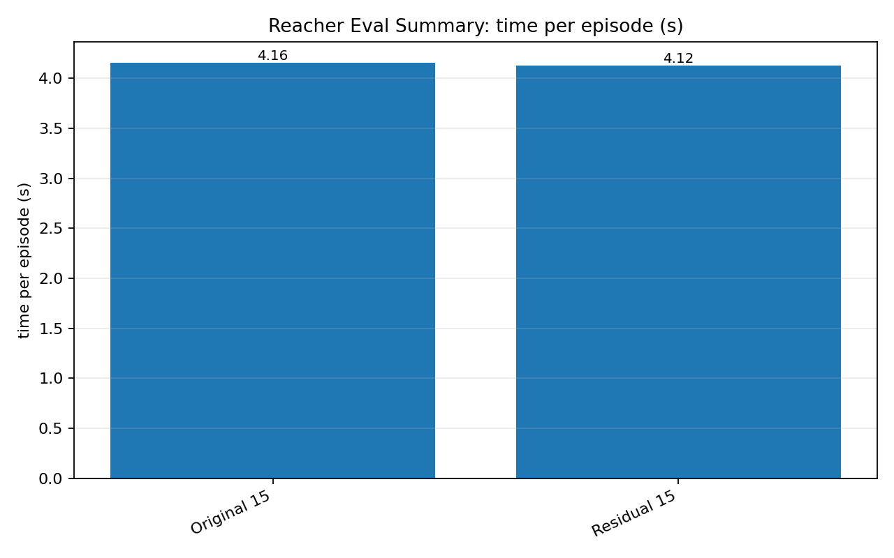

# Reacher Eval Summary

## Summary

| group | n | success mean ± std | min | max | time/episode | eval budget | num eval |
|---|---:|---:|---:|---:|---:|---|---|
| Original 15 | 5 | 62.00 ± 8.00 | 52.00 | 72.00 | 4.16s | 50 | 50 |
| Residual 15 | 5 | 57.60 ± 10.14 | 48.00 | 72.00 | 4.12s | 50 | 50 |

## Figures

